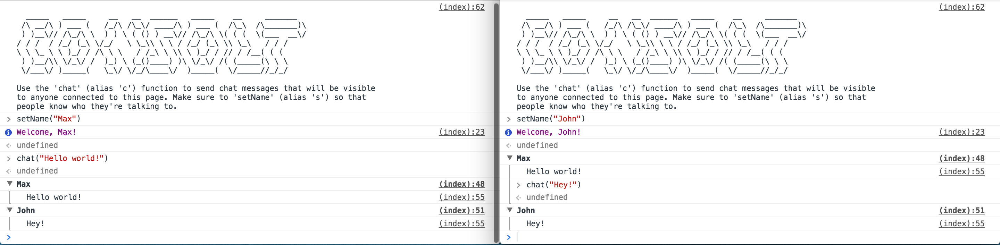

# Consult
__developer console chat room__

Modern browser console's are pretty amazing - you can do introspection, do performance analysis, drag and drop elements of the DOM, and [a whole lot more](https://developer.chrome.com/devtools/docs/console). I thought it would be fun to make a little chat room whose client and view lived entirely inside the chrome console.

And so, without further ado, here it is!

## Usage
The module adds two global variables to the console.

### `chat(text)` (alias `c`)
Post a message to the chat room hosted on the page. Set a name with `setName` first.

### `setName(name)` (alias `s`)
Set your name in the chat room.

## Contributing
As always, be respectful, contributions are welcome. Fork this project, report bugs, suggest enhancements, and submit pull requests.

## License
[MIT](https://opensource.org/licenses/MIT)
